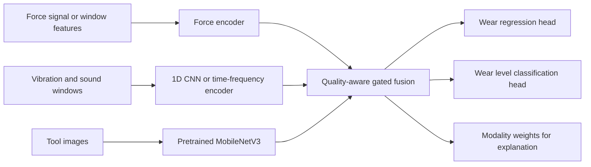

---
tags:
  - AI
  - Multimodal Learning
  - Feature Fusion
  - Tool Wear Monitoring
  - PyTorch
---

# 面向刀具磨损监测的多模态骨干与融合升级

相关知识：

[[Feature Fusion]]

[[Attention]]

[[Transfer Learning]]

[[Multitask Learning]]

## 一、背景

当前项目使用 QIT-CEMC 数据集，包含力/扭矩、振动/声音、刀具图像和磨损标签。已经完成的模型是：

- Force-only：20 维人工统计特征输入两层 MLP；
- 力 + 振动/声音：统计特征拼接后进入 MLP；
- 力 + 图像、三模态：`MobileNetV3-Small(features)` 提取图像特征后，与表格特征直接拼接。

实验中 `Force-only` 的回归结果最好（MAE 0.0540，R2 0.4883），而图像和振动加入后未稳定带来收益。因此，当前的核心问题不是模态数量不足，而是**每个模态的表征质量、对齐方式和融合策略还不足以抵消小样本带来的方差**。

## 二、解决的问题

直接拼接存在三个根本缺陷：

1. 每个周期仅被压缩成少量全局统计量，力和振动信号中的阶段性冲击、频带变化和磨损演化被丢失；
2. 图像骨干从零训练，约 68 个周期不足以学习稳定的磨损纹理、崩刃和边缘形态；
3. 拼接默认所有模态同等可靠，但实际存在振动文件缺失/损坏、图像缺失和不同模态信息增益不一致的问题。

因此，升级目标不是让三模态在所有指标上超过 Force-only，而是构建一个能够：

- 保留 Force-only 稳定性；
- 在样本可信时吸收图像、振动的有效证据；
- 对缺失或低质量模态自动降权；
- 输出可解释的模态贡献；
- 保持端侧可部署规模；

的多模态辅助模型。

## 三、核心思想

先将每个模态编码为可比较的语义向量，再由**带可靠性约束的门控/交叉注意力**决定辅助模态对 Force 主模态的增量，而不是直接拼接所有特征。

## 四、详细原理

### 4.1 模态编码

设力、振动/声音和图像分别为 \(x_f, x_v, x_i\)。为每个模态建立编码器：

\[
h_f = E_f(x_f), \quad h_v = E_v(x_v), \quad h_i = E_i(x_i), \quad h_m \in \mathbb{R}^{d}
\]

其中 \(d\) 应保持较小（如 64 或 128），避免数据量很小时模型容量失控。

- `E_f`：由原来的统计特征 MLP，升级到分窗口特征或 1D 时序网络；
- `E_v`：使用时频特征或轻量 1D CNN；
- `E_i`：使用 ImageNet 预训练的轻量视觉骨干并逐步微调。

### 4.2 门控融合

以 Force 表征为主查询，计算每个辅助模态的可信权重：

\[
g_m = \sigma\left(w_m^T[h_f;h_m;q_m] + b_m\right), \quad m \in \{v, i\}
\]

其中：

- \([;]\) 表示向量拼接；
- \(\sigma\) 为 Sigmoid，输出 0 到 1；
- \(q_m\) 是质量特征，例如文件是否有效、信噪比、图像清晰度或缺失掩码；
- \(g_m\) 越接近 0，模型越接近 Force-only；越接近 1，辅助模态贡献越大。

最终融合特征为：

\[
h = h_f + g_v W_vh_v + g_i W_ih_i
\]

这个残差式结构有一个重要工程优势：当振动或图像没有增益时，模型可以自然退化为稳定的 Force-only 主路径，而不是被拼接噪声拖累。

### 4.3 交叉注意力

当要保留信号分段或图像 patch 时，可使用 Force 引导的交叉注意力：

\[
\operatorname{Attention}(Q,K,V)=\operatorname{softmax}\left(\frac{QK^T}{\sqrt{d_k}}\right)V
\]

令 \(Q=h_fW_Q\)，而 \(K=H_mW_K, V=H_mW_V\)。\(H_m\) 是振动的多个时间窗口特征或图像的多个 patch 特征。这样模型回答的是：“在当前力信号状态下，辅助模态的哪些局部最值得关注？”

对当前项目，不建议立刻上完整 ViT 或大 Transformer。样本很少，优先用单头 cross-attention，或最多 2 层、4 头的轻量模块，并严格做消融。

### 4.4 多任务损失

项目同时预测连续磨损值和磨损等级。当前固定损失为：

\[
\mathcal{L}=\lambda_r\mathcal{L}_{reg}+\lambda_c\mathcal{L}_{cls}
\]

固定 \(\lambda_r,\lambda_c\) 可能使两个任务互相干扰。可改用不确定性加权：

\[
\mathcal{L}=\frac{1}{2\sigma_r^2}\mathcal{L}_{reg}+\frac{1}{2\sigma_c^2}\mathcal{L}_{cls}+\log \sigma_r+\log \sigma_c
\]

\(\sigma_r,\sigma_c\) 是模型学习的任务噪声。噪声更大的任务会被自动降低权重。这比手工调参更适合作为一个明确的科研改进点。

## 五、推荐结构与实施优先级



| 优先级 | 改进 | 为什么适合当前数据 | 成功标准 |
|---|---|---|---|
| P0 | 修正实验协议：按 cycle 做分组划分，使用 5-fold GroupKFold | 小数据下单次切分方差很大，先确认改进真实有效 | 平均值和标准差优于/不劣于基线 |
| P1 | 图像预训练 + 冻结后逐层解冻 | 68 个周期不足以从零训练视觉表征 | 图像单模态或 Force+Image 分类提升 |
| P1 | 残差门控融合 + 模态质量掩码 | 保留 Force-only 主路径并抑制噪声 | 不明显降低回归，输出可解释权重 |
| P2 | 力/振动分窗口 + 1D CNN | 比整段全局统计更能表达切削阶段变化 | 与统计特征基线的公平比较 |
| P2 | 多任务不确定性加权或任务专用 Adapter | 缓解回归与分类目标冲突 | 分类提升而回归不显著恶化 |
| P3 | Force 引导的轻量交叉注意力 | 提供更强的多模态科研表达 | 在 P1/P2 结构有效后才投入 |

## 六、代码实现

下面是适合替换“直接拼接”的最小可运行门控融合核心。它不需要先改数据管线，也能先接入现有的 20 维力特征、振动特征和预训练图像 embedding。

```python
import torch
import torch.nn as nn


class GatedResidualFusion(nn.Module):
    def __init__(self, dim=64, num_classes=4):
        super().__init__()
        self.force_encoder = nn.Sequential(nn.Linear(20, dim), nn.ReLU(), nn.LayerNorm(dim))
        self.vib_encoder = nn.Sequential(nn.Linear(40, dim), nn.ReLU(), nn.LayerNorm(dim))
        self.image_proj = nn.Sequential(nn.Linear(576, dim), nn.ReLU(), nn.LayerNorm(dim))

        self.vib_gate = nn.Sequential(nn.Linear(dim * 2 + 1, dim), nn.ReLU(), nn.Linear(dim, 1))
        self.image_gate = nn.Sequential(nn.Linear(dim * 2 + 1, dim), nn.ReLU(), nn.Linear(dim, 1))
        self.reg_head = nn.Linear(dim, 1)
        self.cls_head = nn.Linear(dim, num_classes)

    def forward(self, force_x, vib_x, image_embedding, vib_valid, image_valid):
        h_force = self.force_encoder(force_x)
        h_vib = self.vib_encoder(vib_x)
        h_image = self.image_proj(image_embedding)

        g_vib = torch.sigmoid(self.vib_gate(torch.cat([h_force, h_vib, vib_valid], dim=1))) * vib_valid
        g_image = torch.sigmoid(self.image_gate(torch.cat([h_force, h_image, image_valid], dim=1))) * image_valid
        fused = h_force + g_vib * h_vib + g_image * h_image

        return {
            "wear_reg": self.reg_head(fused),
            "wear_cls": self.cls_head(fused),
            "vib_gate": g_vib,
            "image_gate": g_image,
        }
```

工程实现顺序应为：

1. 将 `MobileNetV3-Small(weights=None)` 改成官方预训练权重；先冻结 `features`，只训练 `image_proj`、融合层和任务头；
2. 记录每个样本的 `vib_valid`、`image_valid`，而不是在 `dropna` 后静默删除样本；
3. 用上述门控残差融合替换 `torch.cat`；把 gate 保存到推理结果和 Gradio 页面；
4. 图像稳定后，再将力/振动原始序列切为 8 到 16 个窗口，提取窗口 RMS、峰峰值、频带能量，再进入小型 1D CNN；
5. 只有在 P0-P2 有稳定提升时，再加入单层交叉注意力。

## 七、工程应用

在项目中应采用“双路径”部署：

- 边端：运行 Force-only ONNX，获得低延迟的实时磨损预测；
- 边缘网关或上位机：当图像/振动可用时运行门控多模态模型，提供复核、风险等级和模态贡献；
- LLM 层：读取预测值、分类、规则命中与 `vib_gate/image_gate`，生成基于证据的维护建议。

这样，多模态不再被包装为“任何情况下都更准”，而是作为在资源充足、辅助模态可信时提高诊断证据完整性的第二层。这与工业现场的可靠性要求一致，也能解释为什么 Force-only 仍是最终部署主干。

## 八、技术比较

| 方法 | 优点 | 缺点 | 当前建议 |
|---|---|---|---|
| 直接拼接 | 实现最简单 | 默认模态同等可靠，易被噪声拖累 | 保留为 baseline |
| 预训练视觉骨干 + 拼接 | 低成本加强图像表征 | 仍不能处理模态可靠性 | P1 对照实验 |
| 门控残差融合 | 可退化为 Force-only，可解释 | 需设计质量掩码 | 最优先实现 |
| Cross-attention | 能定位跨模态局部关联 | 小数据下易过拟合 | P3，谨慎使用 |
| 大型 Transformer/ViT | 表达能力强 | 现有样本量严重不足 | 当前不建议 |

## 九、面试训练

### 基础问题

**为什么多模态模型没有一定优于单模态？**

多模态的前提是附加模态提供与主模态互补且可靠的信息。样本量不足、同步误差、缺失数据或未经预训练的高维图像特征都会增加估计方差，直接融合反而可能劣于稳定的单模态模型。

### 深入问题

**为什么选择门控残差融合而不是直接拼接？**

直接拼接把所有模态强制交给后续 MLP 使用，无法区分有效信息和噪声。门控机制以 Force 主表征和模态质量共同计算权重，再将辅助模态以残差方式加入。当辅助模态不可靠时，权重接近零，模型自然回退为 Force-only，因此更适合工业数据存在缺失和质量波动的情况。

### 英文问题

**Question: Why did you keep the force-only model as the primary deployment backbone?**

**Answer:** In our experiments, force-only features provided the most stable regression performance. The multimodal inputs were useful as auxiliary evidence, but their gains were not consistent under the limited dataset size and imperfect modality alignment. Therefore, I used the force-only ONNX model for real-time edge inference and designed gated multimodal fusion for richer diagnosis when reliable auxiliary signals are available.

## 今日总结

- 当前模型薄弱点是浅层表征、从零训练的图像分支和无可靠性约束的拼接，不是简单的网络深度不足；
- 最值得做的模型创新是“Force 主干 + 预训练辅助编码器 + 质量感知门控残差融合”；
- 在小样本场景下，分组交叉验证和消融实验比堆叠更大的模型更重要；
- 端侧部署和多模态诊断应分层：实时预测优先稳定，辅助模态优先解释和复核。

## 容易混淆

- `预训练`不等于直接端到端大幅微调。当前数据量下应先冻结大部分视觉骨干；
- `attention`不天然优于门控。attention 解决局部对齐，门控先解决模态是否可信；
- 多模态失败不等于数据没有价值，可能是任务目标、样本划分或融合结构不匹配。

## 下一步

先实现 P0 和 P1：确认按 cycle 分组的交叉验证协议，随后以预训练图像骨干和门控残差融合为唯一主线完成一组可复现实验。只有结果稳定后，再进入时序编码与交叉注意力。
