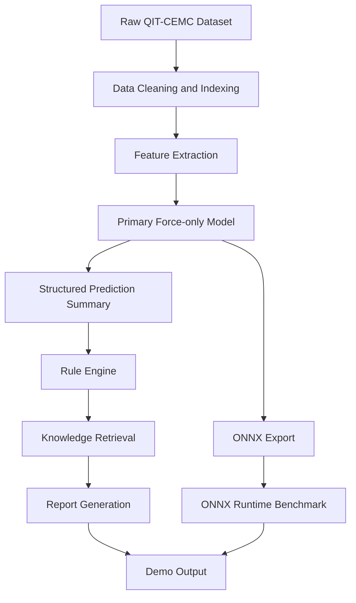
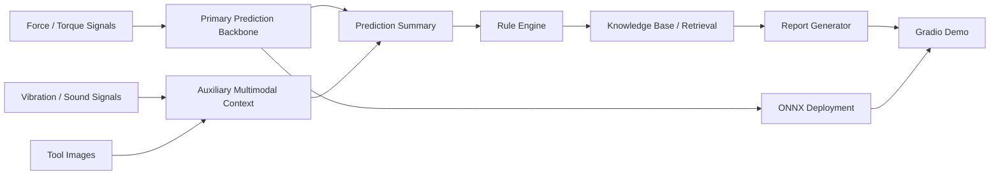

# System Workflow

## 1. System Goal

The system is designed as a complete prototype for tool wear monitoring, explanation, and edge deployment validation.

It contains four major layers:

1. data preprocessing
2. primary prediction
3. explanation and maintenance recommendation
4. deployment and demonstration

## 2. Workflow Overview

```text
Raw Dataset
  -> Data Cleaning and Indexing
  -> Feature Extraction
  -> Primary Prediction Model
  -> Structured Prediction Summary
  -> Rule Engine + Knowledge Retrieval
  -> Diagnostic Report
  -> Demo / Deployment Output
```

## 2.1 Workflow Diagram



## 3. Data Layer

Inputs:

- force and torque signals
- vibration and sound signals
- tool images
- tool wear labels

Processing steps:

- parse raw `xls` labels
- align sensor files and image folders by cycle
- build structured sample index
- split train / val / test by `cycle_id`

Output:

- processed CSV indices under `data/processed`

## 4. Modeling Layer

### 4.1 Primary model

The primary model is:

- `Force-only`

Reason:

- it is the most stable model under current conditions
- it gives the best overall predictive performance
- it is lightweight enough for deployment

### 4.2 Auxiliary multimodal branches

Additional baselines were built for:

- force + vibration/sound
- force + image
- force + vibration/sound + image

Their current role is:

- comparison
- system completeness
- support for explanation context

## 5. Explanation Layer

After prediction, the system builds a structured summary containing:

- predicted wear value
- predicted wear level
- optional ground-truth reference
- model identity
- image usage flag

Then:

1. the rule engine evaluates deterministic rules
2. the retriever maps matched rules to knowledge items
3. the report generator produces a diagnosis report

Current backend modes:

- local template mode
- optional OpenAI-backed generation mode

## 6. Deployment Layer

The primary model can be exported to ONNX.

Deployment flow:

```text
PyTorch model
  -> ONNX export
  -> ONNX Runtime inference
  -> latency / size benchmark
```

This layer supports the edge-AI claim of the project.

## 7. Demo Layer

The current Gradio demo allows:

- selecting a sample
- running prediction
- showing the corresponding tool image
- displaying structured prediction summary
- displaying rule hits
- displaying retrieved knowledge items
- displaying the final diagnostic report
- displaying ONNX benchmark data

## 8. Current Final System Positioning

The most defensible final system interpretation is:

- `Force-only` performs the core prediction task
- multimodal branches enrich the analysis layer
- the explanation module turns predictions into actionable guidance
- the ONNX path validates deployment feasibility

This makes the project a practical end-to-end prototype rather than only a collection of model experiments.

## 9. System Architecture Diagram


